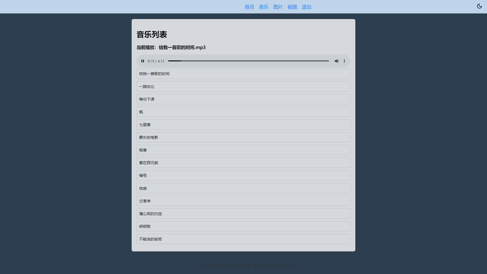

# 极简云盘

在国内网盘没有充值会员时，速度比较慢，体验不佳。写一个php网盘管理项目(nas)，当前处于测试阶段。

编写语言：PHP

| 贡献者 | 我   | chatGPT |
| ------ | ---- | ------- |
|        | 5%   | 95%     |

适用场景：局域网

测试：当前仅测试了linux

漏洞及安全问题：未知，很可能存在漏洞，建议局域网下自己玩玩

其他：局域网共享文件夹似乎比这个方案好一些？🤐

想法：一个二手随身wifi刷armbian，挂个机械盘(极简nas??)

## 使用

把html里的文件复制到/var/www/html目录下

创建盘根目录/var/www/pan，如果把其他目录作为盘根目录，在配置文件里修改

在盘根目录下，创建img，mp3，video等文件夹

权限相关：

由于并不熟悉linux权限知识，我给的权限是

```bash
chown -R www-data:www-data /var/www/pan
chmod -R 755 /var/www/pan
```

## 功能

现在有以下功能

- 在线下载
- 切换主题
- 在线播放音乐
- 在线预览图片

需登录管理员适用以下功能

- 视频在线播放
- 登录验证
- 文件上传
- 新建文件夹

删除文件及文件夹功能没有写，需要管理员在服务端自行删除

## 效果图





## 配置文件config.php

```php
<?php
# 更多图标，请自行到https://www.iconfinder.com/search/icons/related/7077519
$panTitle = "极简盘";
$icons = [
    'txt' => 'icons/txt_icon.png',
    'php' => 'icons/php_icon.png',
    'java' => 'icons/java_icon.png',
    'mp4' => 'icons/mp4_icon.png',
    'xml' => 'icons/xml_icon.png',
    'pdf' => 'icons/pdf_icon.png',
    'doc' => 'icons/word_icon.png',
    'docx' => 'icons/word_icon.png',
    'mp3' => 'icons/mp3_icon.png',
    'png' => 'icons/png_icon.png',
    'jpg' => 'icons/jpg_icon.png',
    'md' => 'icons/md_icon.png',
    'zip' => 'icons/zip_icon.png',
    'html' => 'icons/html_icon.png',
    'folder' => 'icons/folder_icon.png',
];


# 网盘根目录，建议绝对路径。并且不要放在web目录下，否则可能造成文件上传等漏洞
# 禁止web父级目录直接作为根目录
$panDir = "/var/www/pan";

// 获取音乐目录MP3下的所有MP3文件
$musicDir = $panDir . '/mp3/';
// 获取视频目录video下的所有视频文件
# 此处取消注释会报错
// $videoDir = $panDir . '/video/';

# 路径处理
$dir = isset($_GET['dir']) ? urldecode($_GET['dir']) : '';
$fullPath = realpath($panDir . '/' . $dir);

if ($fullPath === false || strpos($fullPath, $panDir) !== 0) {
    $rootDir = $panDir;
} else {
    $rootDir = $fullPath;
}

# admin超管账号，默认admin password，看到这里，请手动生成你的用户名和密码，换为md5摘要，不要明文存储
// $predefinedMd5Hash = md5("$username".":"."$password");
$predefinedMd5Hash = '73eff6386ce2091b5ca702fc007e1da9';

# 允许上传文件的最大大小。
# php.ini配置，已在.user.ini下设置，不用修改
// upload_max_filesize = 1024M
// post_max_size = 1024M
// memory_limit = 1024M
# 需要nginx中添加下面配置，使能够上传1M大小以上的文件
//client_max_body_size 1024M;
```

## 样式

所有样式都堆在了styles/index.css里，依托石山。有...有兴趣可以试着修改。

## 更新日志

- 2024-08-30：上传功能，登录功能，视频播放功能，音乐播放功能，图片预览功能，管理员功能
- 2024-08-30：添加.user.ini文件，免除手动修改php.ini的麻烦
